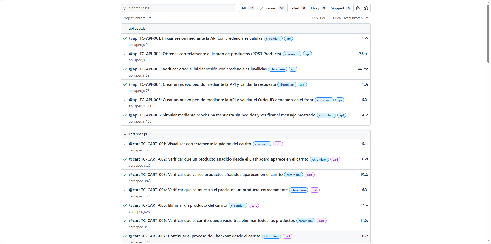

# Playwright E-Commerce Automation

Framework de automatización de pruebas End-to-End desarrollado con **Playwright** y **JavaScript**, aplicando el patrón **Page Object Model (POM)** y siguiendo buenas prácticas de automatización para construir un proyecto mantenible, escalable y reutilizable.

El proyecto automatiza los principales flujos funcionales de una aplicación web de comercio electrónico, incluyendo autenticación, navegación por el catálogo, gestión del carrito, proceso de compra y consulta de pedidos.

---

## Objetivo del proyecto

Este proyecto tiene como objetivo demostrar conocimientos en automatización de pruebas End-to-End con Playwright, aplicando una arquitectura mantenible y buenas prácticas de desarrollo.

Aunque la aplicación permitiría automatizar un número mucho mayor de escenarios y casos de prueba, el propósito de este repositorio no es alcanzar una cobertura funcional completa, sino demostrar una arquitectura mantenible, reutilizable y alineada con las buenas prácticas habituales en proyectos de automatización profesionales.

---

## Tecnologías utilizadas

- Playwright
- JavaScript (ES Modules)
- Page Object Model (POM)
- Node.js 24 LTS
- Faker.js

---

## Funcionalidades automatizadas

Actualmente el proyecto incluye pruebas para:

- Registro de usuarios
- Inicio de sesión
- Dashboard
- Gestión del carrito
- Búsqueda y filtrado de productos
- Checkout
- Consulta de pedidos
- Pruebas API
- Smoke tests

---

## Características

- Automatización End-to-End con Playwright.
- Arquitectura basada en Page Object Model (POM).
- Pruebas UI y API.
- Smoke Tests para validar los flujos críticos.
- Datos dinámicos mediante Faker.
- HTML Report automático.
- Capturas de pantalla y Trace en caso de fallo.
- Casos de prueba documentados.

---

## Estructura del proyecto

```text
playwright-ecommerce-automation
│
├── docs/
│   ├── TestCases.md
│   ├── TestPlan.md
│   └── TestStrategy.md
│
├── pages/
├── test-data/
├── tests/
│
├── playwright.config.js
├── package.json
└── README.md
```

---

## Instalación

### Requisitos

Antes de ejecutar el proyecto es necesario tener instalado:

- Node.js **24.x LTS** (recomendado)
- npm

> **Nota:** El proyecto utiliza la librería **@faker-js/faker**, que requiere una versión reciente de Node.js. Se recomienda utilizar **Node.js 24 LTS** para garantizar la compatibilidad con todas las dependencias.

### Clonar el repositorio

```bash
git clone https://github.com/Antonioegp/playwright-ecommerce-automation.git
```

Acceder al directorio del proyecto:

```bash
cd playwright-ecommerce-automation
```

Instalar las dependencias:

```bash
npm install
```

Instalar los navegadores de Playwright:

```bash
npx playwright install
```

---

## Ejecución de pruebas

Ejecutar toda la suite:

```bash
npx playwright test
```

Ejecutar un archivo de pruebas concreto:

```bash
npx playwright test tests/login.spec.js
```

Ejecutar pruebas mediante tags:

```bash
npx playwright test --grep @login
```

---

## Reportes

Tras la ejecución de las pruebas se generan automáticamente:

- HTML Report de Playwright.
- Capturas de pantalla en caso de fallo.
- Archivos Trace durante los reintentos para facilitar el análisis de errores.

Visualizar el reporte:

```bash
npx playwright show-report
```

---

## Ejecución de la suite

La siguiente imagen muestra una ejecución satisfactoria de la suite completa de pruebas automatizadas.



---

## Buenas prácticas implementadas

- Arquitectura basada en **Page Object Model (POM)**.
- Separación de responsabilidades entre **Pages**, **Tests** y **Test Data**.
- Datos de prueba reutilizables y centralizados.
- Generación de datos dinámicos mediante **Faker**.
- Uso de localizadores robustos mediante Playwright Locators.
- Casos de prueba independientes.
- Métodos reutilizables para reducir duplicidad de código.
- Documentación funcional mediante **Test Plan**, **Test Strategy** y **Test Cases**.
- Código organizado, mantenible y escalable.

---

## Documentación

El proyecto incluye documentación funcional para facilitar su comprensión y mantenimiento:

- **TestPlan.md** → Objetivos, alcance y planificación de las pruebas.
- **TestStrategy.md** → Estrategia de automatización y criterios de ejecución.
- **TestCases.md** → Catálogo de casos de prueba implementados y planificados.

---

## Autor

**Antonio Gómez**

Proyecto desarrollado con fines formativos y como demostración de conocimientos en automatización de pruebas End-to-End con Playwright.